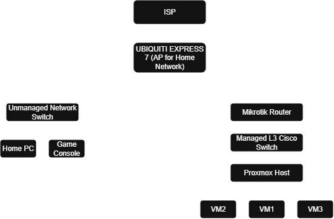

# Jakob's Homelab Infrastructure

A self-hosted enterprise-style lab environment built to practice:

- Networking
- Virtualization
- Linux administration
- Automation
- Monitoring
- Security

## Current Environment

Hardware:
- Proxmox Server
- Managed Switch
- Mikrotik Firewall/Router

Core Technologies:
- Proxmox VE
- VLANs
- Docker
- Linux
- WireGuard
- Grafana
- Ansible

## Current Projects
Building the homelab

## Network Diagram

